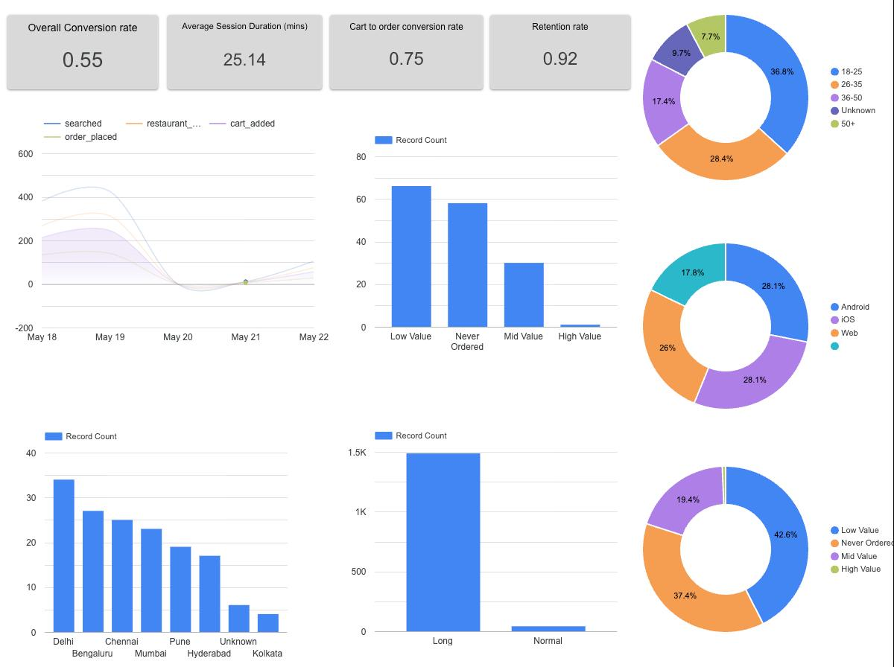

# User Event Analytics Pipeline

An end-to-end data engineering pipeline simulating a real-world user event tracking system — inspired by product analytics at companies like Swiggy and Razorpay.

## Architecture

```
Faker → Python → BigQuery → Great Expectations → dbt → Airflow → Looker Studio
```

## Dashboard

**User Behaviour & Funnel Intelligence Dashboard**

<!-- Replace the line below with your actual screenshot -->


<!-- Replace the URL below with your actual Looker Studio link -->
[View Live Dashboard](https://datastudio.google.com/reporting/64f92900-a743-4457-966f-bc7accc8c3ba)

## Project Structure

```
user-event-analytics-pipeline/
├── ingestion/
│   ├── generate_users.py
│   ├── generate_sessions.py
│   ├── generate_events.py
│   └── pipeline.py
├── expectations/
│   ├── validate_users.py
│   ├── validate_sessions.py
│   └── validate_events.py
├── uea_dbt/
│   └── models/
│       ├── staging/
│       │   ├── stg_users.sql
│       │   ├── stg_sessions.sql
│       │   ├── stg_events.sql
│       │   ├── sources.yml
│       │   └── schema.yml
│       └── marts/
│           ├── mart_funnel_analysis.sql
│           ├── mart_user_segments.sql
│           ├── mart_session_behaviour.sql
│           ├── mart_retention_cohorts.sql
│           └── schema.yml
└── airflow/
    └── dags/
        └── uea_pipeline.py
```

## Data Layer

### Raw (BigQuery — `uea_raw`)
| Table | Description | Daily Volume |
|---|---|---|
| users | New user signups | 20 rows/day |
| sessions | User sessions | 200 rows/day |
| events | User events | 700 rows/day |

### Staging (BigQuery — `uea_staging`)
- `stg_users` — filters null user_ids, coalesces nulls in city, device, age_group
- `stg_sessions` — filters invalid sessions where session_end < session_start, adds session_duration_seconds
- `stg_events` — filters events outside session window, adds event_date

### Marts (BigQuery — `uea_marts`)
| Model | Business Question |
|---|---|
| mart_funnel_analysis | How do users progress through the purchase funnel daily? |
| mart_user_segments | How are users segmented by behaviour, device and demographics? |
| mart_session_behaviour | How do users behave within sessions? |
| mart_retention_cohorts | How well do we retain users over time? |

## Data Quality

- **Great Expectations** — validates raw data already in BigQuery, flags quality issues (null %, row counts, data types)
- **dbt source tests** — validates raw BigQuery tables (unique, not_null)
- **dbt model tests** — validates staging views and mart tables (unique, not_null, accepted_values)

## Orchestration

Airflow DAG (`uea_pipeline`) runs daily at midnight UTC:

```
generate_users → generate_sessions → generate_events → validate_users → validate_sessions → validate_events → dbt_build
```

## Stack

| Tool | Version | Purpose |
|---|---|---|
| Python | 3.11 | Data generation, ingestion |
| Great Expectations | latest | Data validation |
| BigQuery | — | Cloud data warehouse |
| dbt | 1.11 | Transformation, testing, documentation |
| Airflow | 3.2 | Orchestration |
| Looker Studio | — | Dashboard |
